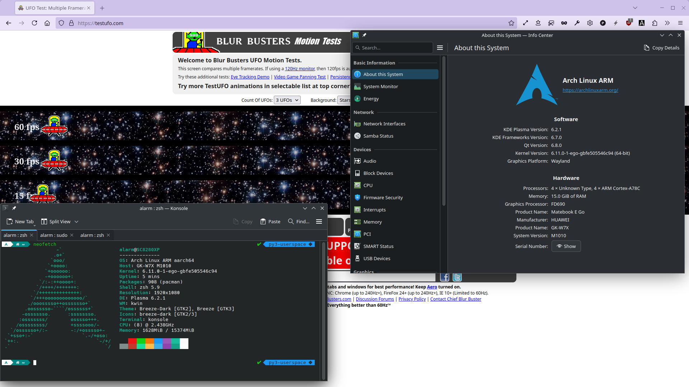

# Huawei Matebook E Go (8cx Gen 3)

This repository contains workarounds for the Huawei Matebook E Go (8cx Gen 3) to support Linux.

This project mainly refers to the following projects:
* [jhovold](https://github.com/jhovold/linux): who adds patches to the mainline to support X13s and SC8280XP (8cx Gen 3).
* [steev](https://github.com/steev/linux): who maintains the kernel for X13s.
* [linaro team](https://patchwork.kernel.org/project/linux-pm/cover/20240614-yoga-ec-driver-v7-0-9f0b9b40ae76@linaro.org/): who authored the Lenovo c630 EC driver, and showed an example how to write auxiliary device modules.
* [Nikita Travkin](https://git.kernel.org/pub/scm/linux/kernel/git/torvalds/linux.git/tree/drivers/platform/arm64/acer-aspire1-ec.c): who authored the very first Acer aspire1(sc7180) i2c EC driver.
* [aymanbagabas](https://github.com/aymanbagabas/Huawei-WMI): who authored Huawei laptop wmi driver and showed the meaning of ACPI identifiers like GBTT, SBTT, etc
* [NewWheat](https://gitlab.com/New-Wheat/linux-for-huawei-matebook-e-2019): who helped me find EC interrupt, and offered one copy of i2c EC driver for reference.
* [chenxuecong2](https://github.com/chenxuecong2/linux-huawei-matebook-e-go) & [matalama80td3l](https://github.com/matalama80td3l/matebook-e-go-boot-works): who migrated the initial device tree from X13s' and added a framebuffer for the Huawei Matebook E Go.

## Disclaimer
I am just an amateur, a Linux noob, not educated with formal CS courses. You should never believe what I say below, except this sentence. I am not responsible for your actions; you do this all at your own risk!

## Kernel
Use steev or jhovold one with default config and `simplefb` enabled.

Kernel parameter: `clk_ignore_unused pd_ignore_unused arm64.nopauth efi=noruntime`

## Device Tree
The DT works with steev's latest branch. You should extract the firmwares required by DT, and get them well placed, you can find them in the Windows OS `DriverStore` directory.

## Feature Support

Refer to [this](https://github.com/jhovold/linux/wiki/X13s) as well.

With kernel version `6.12` by [steev](https://github.com/steev/linux/). (I write against the latest stable kernel release only.)

| Feature | Status | Note |
| ------- | ------ | ---- |
| Audio  | works | see [below](#audio) |
| Backlight | x | DSI DCS-based backlight control, control method had been figured out. There is an I2C baclkight IC, power supply and how to enable keep unknown |
| Battery | works | with my ec driver, cycle count is also supported |
| Bluetooth | partial | paired and connected with my android phone, but keep disconnected with my LinkBuds S |
| Camera | x | |
| CPUfreq | works | |
| Display | x | [There](https://linaro.github.io/msm/soc/sc8280xp) is no DSI driver for SC8280XP now. I added some patches to *patch sets* folder, but still not work |
| Display sensors | x | for rotation detect, light detect, etc. Added slpi nodes, but how can we access it? |
| EFI variables | works | with the [patch](./patch\ sets/fix/0001-firmware-qcom-uefisecapp-add-Huawei-Matebook-E-GO.patch). |
| EC(WIP) | partial | Battery and adapter status, maybe modern standby |
| Fingerprint reader | x | mbn firmwares related.(check your Windows driver repo) x13s one was introduce from [commit](https://github.com/torvalds/linux/commit/d280fe309b88b337a9b26f96b7a9d9aa6d6c3a0f). |
| GPU | works | It works, but the dsi output not, the image is actually here, check [this](./feature_spoliers/gpu.png) |
| Hibernation | x | |
| Keyboard | works | |
| Keyboard fn keys | partial | |
| NVMe SSD | works | |
| PCIe (x4) | works | |
| Power key | works | |
| Remoteproc | works | adsp, cdsp, sdsp(sensors related, see [below](./#SLPI)) |
| RTC | works | |
| Suspend | works | s2idle |
| Thermal sensors | works | partial I think |
| Touchpad | works | |
| Touchscreen | partial | weird behavior |
| TPM | x | |
| USB | works | |
| USB-PD | works | With UCSI EC driver, charging power is up to 45W compared to 23w before. In alt modes, can be used as sink and source |
| USB-C DisplayPort Alt Mode | works | initial support |
| Video acceleration | unsure | depends on the main display driver status |
| Virtualisation | x | |
| Volumn keys | works | |
| Watchdog | partial | One in sc8280xp works, another in EC not(acpi method identifiers have not been figured out yet) |
| Wi-Fi | works | use the 2.4 GHz band for stability. |
| WMI related features| partial | charging control, FN lock, smart charge, thermal sensors and so on(undiscoverd things due to its meaning is unknown) |

## Altmode
Specific insert orientation required, support 2-lane(up to 1080P@60HZ) only for now, Johan mentioned [this](https://github.com/jhovold/linux/wiki/X13s#USB) also.

BTW, ~there are some issues(failed to register altmode, failed to reset PPM, which cause a UCSI registeration failure, race conditions, data inconsistency, etc)~, after all, I havn't mastered the whole procedure yet(Reversing is like that, you can't ask for too much or perfect, lol), some of them are related to Qualcomm's quirks, ~some are my code issues~. I am working on it to minimize the potential harm to your device. So it won't be released until I finish it.

~Chances are that you keep rebooting, failed to register altmode, or some other things, until one time no error here, you may get it work.~

~We will not reboot now, but we will still reboot it manually to make sure UCSI register normally. Until you don't get~(With new fixes, the UCSI driver is quiet reliable now, unlikely to meet these issues, if still, reboot)
```
gaokun_ucsi.ucsi gaokun_ec.ucsi.0: error -ETIMEDOUT: PPM init failed
gaokun_ucsi.ucsi gaokun_ec.ucsi.0: con1: failed to register alt modes
```
If there is no issue now, let's plug in(make sure your orientation(device end, unnecessary for display end) is not reverse), wait for seconds, if you still not get external display work, check if there are entries in your `dmesg` like `gaokun_ucsi_refresh: USB event triggered, data: 00 06 02 01 08 13 02 00 16`. If you get `xxx data: xxx 09 xxx`, that means, your orientation is reverse, flip it.

Remember that, replug will not fully work, if you replug, you mostly get a still frame, but if you reboot at that time, logs may appear on your external display.

Some people have asked me for an early access to the altmode part code. Now I explain here.
### Todo list
1. [x] ~refactor ECCD implementation to avoid data inconsistency(local repo finished, replacement work still remains)~ (New paln: try to add an abstracion layer, but the related dsdt implementation is ..., huawei you sucks)
1. [x] refactor UCSI part code
1. [x] add a sysfs to tweak EC
1. [x] add the altmode part code to UCSI
1. [ ] fix Qualcomm's quirks

Remote repo is far behind local repo due to stability, and my local repo is quite different. \
Why don't you create another branch for it? No, if I open it, I should clarif my intentions, I am tired of constant maintenance, I don't like commit every piece of modification, because I start over again when my new ideas don't work, I will most likely delete all I have written. That is time-wasting to keep track those things. Every time I work on one part only, I can maintain context in my brain, until things are settled, I will update my local repo. After some tests, I will plan to update remote repo.

About ETA, I can't promise due to recent health reasons. And, as an amateur, I have my own life, my coding time is flexible.




## Audio
Recently, use the X13s' profile. \
`sed -i 's/LENOVO.*ThinkPad X13s.*/LENOVO.*ThinkPad X13s.*|HUAWEI.*MateBook E.*\"/' /usr/share/alsa/ucm2/Qualcomm/sc8280xp/sc8280xp.conf`

## Battery
### Charging control
`echo 'start stop' /sys/devices/platform/gaokun-wmi/charge_control_thresholds`

Clarification from [TLP](https://linrunner.de/tlp/faq/battery.html).
> Start charge threshold (START_CHARGE_THRESH_BATx): battery charge level below which charging will begin when connecting the charger.

> Stop charge threshold (STOP_CHARGE_TRESH_BATx): battery charge level above which charging will stop while the charger is connected.

The values would not be saved after you shut down and plugged out, the default values are set to `0 0` at next boot, you can use `udev` to set the default values like `55 60`,
```
ACTION=="add", SUBSYSTEM=="platform", KERNEL=="gaokun-wmi", ATTR{charge_control_thresholds}="55 60"
```

### Smart charging
Explanation, refer to Huawei support [page](https://consumer.huawei.com/en/support/content/en-us15783714/) \
`cat /sys/devices/platform/gaokun-wmi/smart_charge` \
`cat /sys/devices/platform/gaokun-wmi/smart_charge_param`

> When the laptop is just connected to a power adapter, it starts charging until the battery level reaches 70% if the battery level is lower than 70%, or the battery level does not increase if the battery level is 70% or higher. This is normal.

> When the power adapter is always connected, the laptop starts charging if its battery level is lower than 40%, and stops charging when the battery level reaches 70%.

`smart_charge`: default are 4 72 40 70, correspond to charging mode, delay, start, stop, after 72 hours, charging level is limited to 70%.

`smart_charge_param`: enable or not? Recently, If it is 1, then charge power might be up to 23W.(unsure)

If you set charging control on Windows, like 90%, then `smart_charge` would be `1 72 85 90`, `charge_control_thresholds` would be reset to `85 90` also.

## Camera
* front: hi846 or s5k4h7
* rear: ov13b10 or s5k3l6

## Display
There are too many unknowns(dsi support, dual dsi with video mode dsc, gpio, power supply, backlight, etc), no actual progress can be confirmed, I have uploaded all my progress, if you have an idea, then go ahead.

### KMS pipeline

```
+-------------+      +-------+
| framebuffer | ---> | plane |\
+-------------+      +-------+ \      +------+      +---------+      +---------------+      +-----------+
                                |---> | CRTC | ---> | encoder | ---> | dsi connector | ---> | dsi panel | 
+-------------+      +-------+ /      +------+      +---------+      +---------------+      +-----------+
| framebuffer | ---> | plane |/
+-------------+      +-------+
```

`framebuffer` should be okay, as we can capture [screenshot]((./feature_spoliers/gpu.png)). `plane` and `CRTC` are unsure, but information from debugfs indicate primary plane and cursor plane are alright. There are many issues with DPU encoders, dual-dsi support issue, dsi video mode dsc support issue, etc. Upstream has been committing patches to fix them. If other parts function well, panel should show garbled or something else. As for connector, I guess they have no plan to support, there are few devices shipped with dsi panel. I have added support for dsi and dsi phy, which is guessing based on `SM8350` and `SM8450`. Also, I have added support for DSI panel.

Some issues:
* dsi fifo error: `dsi_err_worker: status=4`. 
* backlight: there is a backlight ic which is controlled by i2c, once we enable `msm`(I think the cause is `dpu`), dsi panel reinit, I guess backlight ic would be disabled, in fact, some i2c4 slaves disappeared, I think there must be garbled on screen, we can't see it due to disabled backlight.

During the probe of panel, after we sent initial code to dsi(prepare), then dpu would send video stream to dsi, if we created a backlight device previously, KMS would turn on it for us(enable), but we would get `msm_dsi ae94000.dsi: [drm:dsi_cmds2buf_tx [msm]] *ERROR* wait for video done timed out`, because backlight ic wouldn't respond.

## FN Lock
`echo 0/1 > /sys/devices/platform/gaokun-wmi/fn_lock_state` \
`0`: disable the fn key(hotkey first, such as press `F1` to decrease brightness) \
`1`: enable the fn key(function key first), you can only trigger hotkey with `Fn + F1-12` \
BTW, you can press `Fn` key(light on) to reverse it temporarily.

## Thermal Sensors from EC
I don't know these sensors for which devices, but you can read them \
`cat /sys/devices/platform/gaokun-wmi/temperature`

## Features spoilers
[battery](feature_spoliers/battery_features.png)

## SLPI
SLPI(Sensor Low Power Island), [more details](https://lore.kernel.org/linux-devicetree/20230406173148.28309-1-me@dylanvanassche.be/).
```
[    2.606897] remoteproc remoteproc2: remote processor 2400000.remoteproc is now up
[    2.613505] qcom,fastrpc 2400000.remoteproc:glink-edge.fastrpcglink-apps-dsp.-1.-1: no reserved DMA memory for FASTRPC
```
The firmware of slpi can be loaded, you can also find `/dev/fastrpc-sdsp`, not support `IOMMU` for now. Even though, how can I access sensors?

## Progress
Inactive(Since 10/2024), due to real life things.

## Help wanted
I am occupied with real life things, I spend much free time on it, if someone can help me test features, that will be awesome. Also, as I am an amateur, I am happy to receive suggestions from coding, ACPI/DSDT/SSDT reversing, working mechanism of DSI panel, etc.
