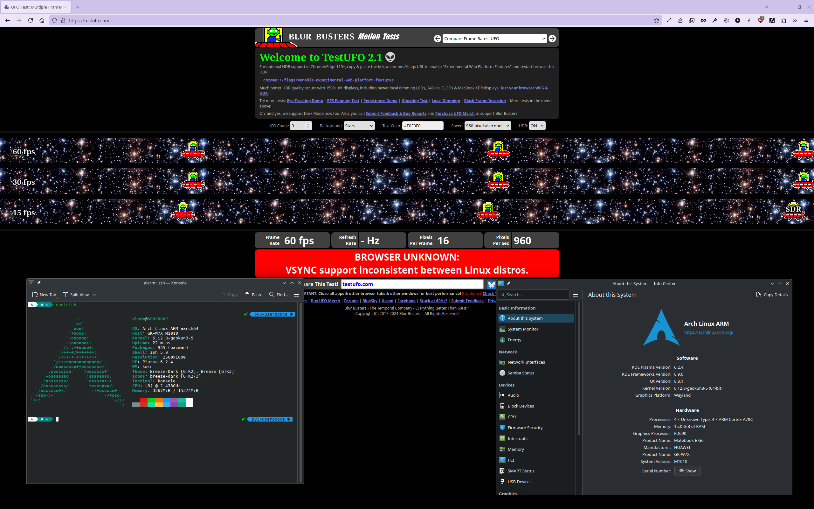

# Huawei Matebook E Go (8cx Gen 3)

This repository contains workarounds for the Huawei Matebook E Go (8cx Gen 3) to support Linux.

This project mainly refers to the following projects:
* [jhovold](https://github.com/jhovold/linux): who contributes to the mainline to support X13s and SC8280XP (8cx Gen 3).
* [steev](https://github.com/steev/linux): who maintains the kernel for X13s.
* [linaro team](https://patchwork.kernel.org/project/linux-pm/cover/20240614-yoga-ec-driver-v7-0-9f0b9b40ae76@linaro.org/): who authored the Lenovo c630 EC driver(first proposed), and showed an example how to write auxiliary device modules.
* [Nikita Travkin](https://git.kernel.org/pub/scm/linux/kernel/git/torvalds/linux.git/tree/drivers/platform/arm64/acer-aspire1-ec.c): who authored the very first(first upstreamed) Acer aspire1(sc7180) i2c EC driver.
* [aymanbagabas](https://github.com/aymanbagabas/Huawei-WMI): who authored Huawei laptop wmi driver and showed the meaning of ACPI identifiers like GBTT, SBTT, etc
* [NewWheat](https://gitlab.com/New-Wheat/linux-for-huawei-matebook-e-2019): who helped me find EC interrupt, and offered one copy of i2c EC driver for reference.
* [chenxuecong2](https://github.com/chenxuecong2/linux-huawei-matebook-e-go) & [matalama80td3l](https://github.com/matalama80td3l/matebook-e-go-boot-works): who migrated the initial device tree from X13s' and added a framebuffer for the Huawei Matebook E Go.

***The time span is very long. If I forget someone's work, please remind me, if I recall something, I will add it.***

## Upstream Progress
Initial dt support will land on 6.14.

Initial EC support will land on 6.15.

## Disclaimer
I am just an amateur, a Linux noob, not educated with formal CS courses. You should never believe what I say below, except this sentence. I am not responsible for your actions; you do this all at your own risk!

## Device Tree
The DT works with steev's latest branch. You should extract the firmwares required by the DT, and get them well placed, you can find them in the Windows OS `DriverStore` directory. (Update: AUR [here](https://aur.archlinux.org/packages/linux-firmware-gaokun3))

## Kernel
Use steev or jhovold one with default config and `simplefb` enabled. (Update: AUR [here](https://aur.archlinux.org/pkgbase/linux-gaokun3))

Kernel parameter: `clk_ignore_unused pd_ignore_unused arm64.nopauth efi=noruntime`

## Prebuilt Bianry
Search for `gaokun` from another one of my repo, [here](https://github.com/right-0903/my_arch_auto_pack/releases/tag/packages).

The image and a copy of packages from another repo, see [release](https://github.com/right-0903/linux-ego/releases/tag/packages).

User and password are both `alarm` and both `root`.

## Feature Support

Refer to [this](https://github.com/jhovold/linux/wiki/X13s) as well. If you want to see some spoilers, check [this](./feature_spoliers/).

With kernel version `6.12` by [steev](https://github.com/steev/linux/). (I write against the latest stable kernel release only.)

| Feature | Status | Note |
| ------- | ------ | ---- |
| Audio  | works | see [below](#audio) |
| Backlight | x | DSI DCS-based backlight control, control method had been figured out. There is an I2C baclkight IC, power supply and how to enable keep unknown |
| Battery | works | For hidden attributes, check `/sys/class/power_supply/gaokun-ec-battery/`  |
| Bluetooth | works | RF performance is incredible when you have set calibration data for wifi(they are both on the chip of WCN6855) |
| Camera | x | WIP |
| CPUfreq | works | |
| Display | x | No DSI, panel, backlight drivers |
| Display sensors | x | for rotation detect, light detect, etc. Added slpi nodes, but how can we access it? |
| EC | works | Battery and adapter status, wmi, ucsi,maybe modern standby |
| EFI variables | works | |
| Fingerprint reader | x | mbn firmwares related which means that is complicated. x13s one was introduce from [commit](https://github.com/torvalds/linux/commit/d280fe309b88b337a9b26f96b7a9d9aa6d6c3a0f). |
| GPU | works | Freedreno 690([FD690](./feature_spoliers/gpu.png)), remember to install `vulkan-freedreno` to enable vulkan support. |
| Hibernation | x | |
| Keyboard & Touchpad | works | |
| Keyboard fn keys | partial | Assistant key(between `F6` and `F7`), WIFI key(`F9`), and Manager key(`F10`), they don't work. |
| Lid | x | basically works, revaluate it until dsi panel works |
| NVMe SSD | works | |
| PCIe (x4) | works | |
| Power key | works | |
| Remoteproc | works | adsp, cdsp, sdsp(sensors related, see [below](./#SLPI)) |
| RTC | works | |
| Suspend | works | s2idle |
| Thermal sensors | works |  |
| Touchscreen over i2c | partial | weird behavior, I think NHLOS use this, such as BIOS configuration |
| Touchscreen over spi | x | Anyways, it uses spi on Windows. Driver reference[1](https://github.com/MiCode/Xiaomi_Kernel_OpenSource/tree/dagu-s-oss/drivers/input/touchscreen/hxchipset), [2](https://lore.kernel.org/all/TY0PR06MB5611B4E88D79DE738241F5639E0F2@TY0PR06MB5611.apcprd06.prod.outlook.com), [3](https://lore.kernel.org/all/20231017091900.801989-1-tylor_yang@himax.corp-partner.google.com), it is a suffering to port it. |
| TPM | x | |
| USB | works | |
| USB-PD | works | With UCSI EC driver, charging power is up to 45W compared to 23w before, can be used as sink and source |
| USB-C DisplayPort Alt Mode | works |  |
| Video acceleration | works | see [below](#Video-acceleration) |
| Virtualisation | x | |
| Volumn keys | works | |
| Watchdog | partial | One in sc8280xp works, another in EC not(acpi method identifiers have not been figured out yet) |
| Wi-Fi | works | see [below](#Wi-Fi) |
| WMI related features| partial | charging control, FN lock, smart charge, thermal sensors and so on |

---

## Altmode

> [!CAUTION]
> Recently, UCSI subsystem is buggy for this tablet. Chances are that failed to boot(auto reboot). Only plug into Type-C ports after booting up.

Support 2-lane only for now(only half of clocks are enabled), Johan mentioned [this](https://github.com/jhovold/linux/wiki/X13s#USB) also, but we don't require insert orientation.

In default, the bandwidth of per lane is limited to 5.4Gbps(HBR2, DisplayPort 1.2 or later). If you want to a higher limit, set this.

```
...
&mdss0_dp0_out {
...
        link-frequencies = /bits/ 64 <1620000000 2700000000 5400000000 8100000000>;
...
};
...
```

According to the [dcoument](https://learn.microsoft.com/en-us/windows/arm/dev-kit/#set-up-display---how-to-connect-monitors) of Windows Dev Kit 2023, USB-C ports support 8.1Gbps per lane(HBR3, DisplayPort 1.3 or later).

In my case, the monitor supports DisplayPort 1.1 with 2.7Gbps per lane, data rate is 4.32Gbps(8b10b coding), basically, it means I can only use 1920x1080@60Hz. However, if we tweak the timings(at your risks), we can support a decent resolution with a rich timings, 24bpp with 2048(+180H.Blanking)x1280(+60V.Blanking)@60hz $\approx$ 4.30Gbps. If the bandwidth limit is exceeded, your bpp will be degraded to 18 (or lower?) to make actual bandwidth under the limit.

This part is not that stable, you may get a auto reset when you plug out or replug, after all, I havn't mastered the whole procedure yet(Reversing is like that, you can't ask for too much or perfect, lol), some of them are related to Qualcomm's quirks, some are my code issues. I am working on it to minimize the potential harm to your device.

If you encounter the following, reboot, it is rare, but still possible.
```
gaokun_ucsi.ucsi gaokun_ec.ucsi.0: error -ETIMEDOUT: PPM init failed
gaokun_ucsi.ucsi gaokun_ec.ucsi.0: con1: failed to register alt modes
```
If there is no issue now, let's plug in wait for seconds.

***Note: if you plug out when there is no other video output device(logical), replug will not work.***




## Audio
Recently, use the X13s' profile. \
`sed -i 's/LENOVO.*ThinkPad X13s.*/LENOVO.*ThinkPad X13s.*|HUAWEI.*MateBook E.*\"/' /usr/share/alsa/ucm2/Qualcomm/sc8280xp/sc8280xp.conf`

## Battery
### Charging control

`echo '72' /sys/class/power_supply/gaokun-ec-battery/smart_charge_delay`

`echo '40' /sys/class/power_supply/gaokun-ec-battery/charge_control_start_threshold`

`echo '70' /sys/class/power_supply/gaokun-ec-battery/charge_control_end_threshold`

`echo '0/1' /sys/class/power_supply/gaokun-ec-battery/battery_adaptive_charge`

That means plugged in after 72 hours, charging level is limited to 70%.

> When the laptop is just connected to a power adapter, it starts charging until the battery level reaches 70% if the battery level is lower than 70%, or the battery level does not increase if the battery level is 70% or higher. This is normal.

> When the power adapter is always connected, the laptop starts charging if its battery level is lower than 40%, and stops charging when the battery level reaches 70%.

Further explanation, check Huawei support [page](https://consumer.huawei.com/en/support/content/en-us15783714/)

The values would not be saved after you shut down and plugged out, you can use `udev` to set the default values, like
```
ACTION=="add", SUBSYSTEM=="power_supply", KERNEL=="gaokun-ec-battery", ATTR{smart_charge_delay}="0", ATTRS{charge_control_start_threshold}="45", ATTRS{charge_control_end_threshold}="50", ATTRS{battery_adaptive_charge}="1"
```

## Camera
* front camera sensor: hi846(cci2, gpio12: cci_i2c_sda, gpio13: cci_i2c_scl, CAMCC_MCLK3_CLK: 24MHz, gpio17, reset: gpio15)
* rear camera sensor: s5k3l6(cci1, gpio10: cci_i2c_sda, gpio11: cci_i2c_scl, CAMCC_MCLK4_CLK: 24MHz, gpio6, reset: gpio7)

The rear sensor can't be detected.

## Display
There are too many unknowns(dsi support, dual dsi with video mode dsc, gpio(0,1,8,20,24,52,53,...), power supply, backlight, etc), no actual progress can be confirmed, I have uploaded all my progress, if you have ideas, then go ahead.

**Addition: Some patches are first proposed by [matalama80td3l](https://github.com/matalama80td3l) at [here](https://gitlab.freedesktop.org/drm/msm/-/issues/56). I verified and completed them.**

### KMS pipeline

```
+-------------+      +-------+
| framebuffer | ---> | plane |\
+-------------+      +-------+ \      +------+      +---------+      +---------------+      +-----------+
                                |---> | CRTC | ---> | encoder | ---> | dsi connector | ---> | dsi panel | 
+-------------+      +-------+ /      +------+      +---------+      +---------------+      +-----------+
| framebuffer | ---> | plane |/
+-------------+      +-------+
```

`framebuffer` should be okay, as we can capture [screenshot]((./feature_spoliers/gpu.png)). `plane` and `CRTC` are unsure, but information from debugfs indicate primary plane and cursor plane are alright. There are many issues with DPU encoders, dual-dsi support issue, dsi video mode dsc support issue, etc. Upstream has been committing patches to fix them. If other parts function well, panel should show garbled or something else. As for connector, I guess they have no plan to support, there are few devices shipped with dsi panel. I have added support for dsi and dsi phy, which is guessing based on `SM8350` and `SM8450`. Also, I have added support for DSI panel.

Some issues:
* dsi fifo error: `dsi_err_worker: status=4`. 
* backlight: there is a backlight ic which is controlled by i2c, once we enable `msm`(I think the cause is `dpu`), dsi panel reinit, I guess backlight ic would be disabled, in fact, some i2c4 slaves disappeared, I think there must be garbled on screen, we can't see it due to disabled backlight.

During the probe of panel, after we sent initial code to dsi(prepare), then dpu would send video stream to dsi, if we created a backlight device previously, KMS would turn on it for us(enable), but we would get `msm_dsi ae94000.dsi: [drm:dsi_cmds2buf_tx [msm]] *ERROR* wait for video done timed out`, because backlight ic wouldn't respond.

## FN Lock
`echo 0/1 > /sys/devices/platform/soc@0/ac0000.geniqup/a9c000.i2c/i2c-15/15-0038/fn_lock` \
`0`: disable the fn key(hotkey first, such as press `F1` to decrease brightness) \
`1`: enable the fn key(function key first), you can only trigger hotkey with `Fn + F1-12` \
BTW, you can press `Fn` key(light on) to reverse it temporarily.

## Thermal Sensors from EC
I don't know these sensors for which devices, but you can read them \
`sensors`
```
gaokun_ec_hwmon-i2c-15-38
Adapter: Geni-I2C
temp1:        +47.4°C
...
temp20:       +25.9°C
```


## SLPI
SLPI(Sensor Low Power Island), [more details](https://lore.kernel.org/linux-devicetree/20230406173148.28309-1-me@dylanvanassche.be/).
```
[    2.606897] remoteproc remoteproc2: remote processor 2400000.remoteproc is now up
[    2.613505] qcom,fastrpc 2400000.remoteproc:glink-edge.fastrpcglink-apps-dsp.-1.-1: no reserved DMA memory for FASTRPC
```
The firmware of slpi can be loaded, you can also find `/dev/fastrpc-sdsp`, not support `IOMMU` for now. Even though, how can I access sensors?

## Video acceleration
The firmware can be loaded.

The api like VA-API, VDPAU, which are most modern tools/apps supported, like firefox, vlc, obs-studio. This platform does not support them,(It supports v4l2_m2m) so there is no easy way to test it.

## Wi-Fi
Use [the script](https://github.com/qca/qca-swiss-army-knife/blob/master/tools/scripts/ath11k/ath11k-bdencoder),

extract all files from the board file, you can get it from your local directory or [here](https://git.kernel.org/pub/scm/linux/kernel/git/firmware/linux-firmware.git/tree/ath11k/WCN6855/hw2.0),

```
./ath11k-bdencoder -e board-2.bin
```

edit `board-2.json`, let us use x13s one calibration data,

```
...
"board": [
...
            {
                "names": [
                    "bus=pci,vendor=17cb,device=1103,subsystem-vendor=17cb,subsystem-device=0108,qmi-chip-id=2,qmi-board-id=255,variant=HW_GK3"
                ],
                "data": "bus=pci,vendor=17cb,device=1103,subsystem-vendor=17cb,subsystem-device=0108,qmi-chip-id=2,qmi-board-id=140,variant=LE_X13S.bin"
            },
...
]
...
```

regenerate it,

```
./ath11k-bdencoder -c board-2.json
```
